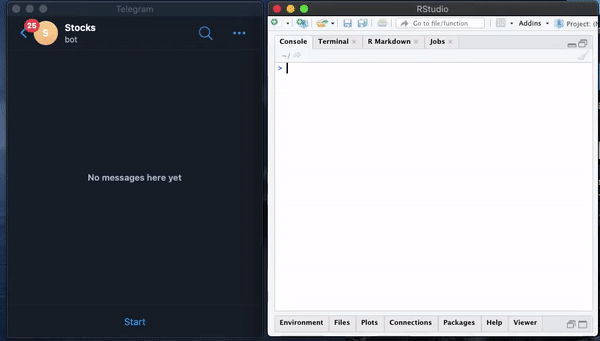
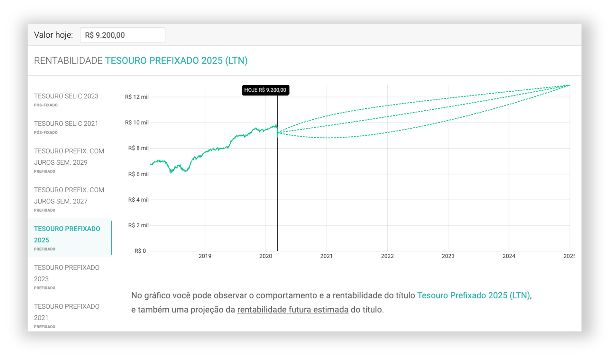

<!-- Resolver lista de todo -->

<!-- Required meta tags -->
<style>
<!-- Bootstrap CSS -->
<link rel="stylesheet" href="https://maxcdn.bootstrapcdn.com/bootstrap/4.0.0/css/bootstrap.min.css" integrity="sha384-Gn5384xqQ1aoWXA+058RXPxPg6fy4IWvTNh0E263XmFcJlSAwiGgFAW/dAiS6JXm" crossorigin="anonymous"> 
</style>

```{r setup, include=FALSE}
knitr::opts_chunk$set(echo = TRUE, message = F, warning = F, fig.align = "center")

# Carregar pacotes:
library(dplyr)         # manipulacao de dados
library(purrr)         # programacao funcional
library(knitr)         # tabela
library(kableExtra)    # formatar tabela
library(formattable)   # extrasformatar tabela
library(alphavantager)
library(prophet)

key <- "TIMTJBAT1ENM1XF1"
av_api_key(key)

ggplot2::theme_set(ggplot2::theme_bw())

kable2 <- function(x){
  x %>% 
    kable(format = "html", escape = F) %>%
    kable_styling(c("striped", "bordered", "hover", "responsive"), full_width = F) 
}
source("moeda_real.R")
```

<center>{width=80%}</center>

# Por que investir?

Como esta sua situacao financeira? Caso tenha alguma reserva pode ser interessante pensar em investimentos pois a poupança já não é mais garantia de lucro no longo prazo, não acredita?

Já estamos no início de 2020 e desde 2019 já se liam notícias como esta abaixo que levam à reflexão sobre reeducação financeira pois alertam a sobre a necessidade de procurar novas oportunidades de investimento.

<center>{width=50%} <br><small>Fonte: <https://noticias.r7.com/economia/economize/poupanca-em-baixa-exige-busca-por-novos-investimentos-em-2020-25122019></small></center></br>

Com a finalidade de fomentar um pouco a discussão sobre investimentos, trouxe nesse post algumas sugestões e idéias sobre como otimizar nossas escolhas e tentar equilibrar nosso risco em novos investimentos combinando elementos de estatística, machine learning e programação em R.

<div class="alert alert-danger" role="alert">
`r icon::fa("exclamation-triangle")` **AVISO**: Este post **não** tem como finalidade ser um guia de investimentos (Já existem muitas consultorias especializadas nisso por ai). Todos as decisões tomadas como diversificação da carteira, seleção de ações e critérios para desmontagem da carteira são **exemplos** e servem para ilustrar algumas **possibilidades** que um cientista de dados têm na hora de desenvolver ferramentas para auxiliar à tomada de decisão.
</div>

Ao final do post criaremos um robo que analisará as cotações e enviará menssagens para nós com uma tabela financeira automatizada via telegram como mostra na animação:

<div class="row">
<div class="col-4">
<center>{width=60%}</center> 
</div>
<div class="col-8">
{width=70%}
</div> 
</div>
</br>

Esse será nosso objetivo final, então mão à obra!

## Diferenca de poupar e investir

De acordo com um [especialista entrevistado pela InfoMoney](https://www.infomoney.com.br/minhas-financas/brasileiros-nao-sabem-a-diferenca-entre-poupar-e-investir-afirma-especialista-2/): 

> “Poupar é guardar dinheiro para usar no futuro, comprar alguma coisa com ele. Investimento é juntar dinheiro, não mexer nele, para que este gere rendimentos e aí sim, usar os lucros mais para frente. É o recomendado para quem quer viver de renda no futuro, por exemplo” (...)
<div align="right"><font size="1">InfoMoney - Ago 2015</font></div>

Ou seja, poupar é acumular agora para utilizr depois, e normalmente envolve mudança de hábitos, pois requer uma redução nos gastos pessoais e familiares, já Investir é usar esse dinheiro poupado em aplicações que rendam.

Como todo mundo sabe, não existe investimento sem risco e este risco deve ser controlado e utilizado a nosso favor de forma que gere alguma segurança financeira.

# Montagem da carteira

<div class="row">
<div class="col-8">

Provamente você já ouviu essa frase alguma vez na vida e ela certamente faz sentido. Não colocar todos os ovos na mesma cesta significa que você deve diversificar o seu investimento.

Diversificar a carteira irá proteger seus investimentos diminuindo o risco pois, imagine só, você investe todo o seu dinheiro em uma empresa e ela passa por alguma crise assim seu dinheiro estará todo comprometido! 

Existem diversos motivos para se diversificar a carteira mas acho que essa metáfora dos ovos já resume bem.

</div> 
<div class="col-4">
{width=80%}
</div> 
</div>

## Como dividir a carteira?

Dependendo do risco que você deseja se expor existem muitas formas de preparar a carteira mas a idéias principal é a seguinte:

* Renda fixa: Menor exposição, menor risco 
* Renda variável: Maior exposição, maior risco

Para ajudar a dividir a carteira de investimentos neste post utilizaremos a chamada [Regra (ou Lei) dos 80](https://www.btgpactualdigital.com/blog/coluna-gustavo-cerbasi/defina-sua-estrategia-entre-renda-fixa-ou-variavel).

A estratégia é a seguinte: subtraia da sua idade o número 80. O resultado dessa conta vai indicar o percentual a ser investido em [renda variável](https://pt.wikipedia.org/wiki/Renda_vari%C3%A1vel). Por exemplo, no meu caso: tenho 26 anos, portanto $80-26 = 54\%$ deverá ser investido em renda variável. Aos 53 anos esse percentual vai cairá para a metade, $27\%$.

A idéias principal por trás desta regra que é que a cada ano que passa, 1% do montante da renda variável deva ser direcionado para a [renda fixa](https://pt.wikipedia.org/wiki/Renda_fixa).

Para testar diferentes valores seguindo esta regra desenvolvi uma função que se chama `montagem80()` (que já está disponível no github TODO). Vejamos alguns resultaodos para diferentes cenários e vamos selecionar um para seguir com a montagem da carteira:

```{r}
source("montagem80.R")
```

<div class="container">
<div class="row">
<div class="col">
<span class="border border-danger">
1. Entrada de R$20.000,00</span> `r icon::fa("hand-point-left", color = "#FA504D")`
```{r}
montagem80(entrada = 20000, idade = 26)
```
</div>
<div class="col">
2. R$ 5.000,00 em acoes 
```{r}
montagem80(variavel = 5000, idade = 53)
```
</div>
</div>

Utilizaremos a primeira (1.) que esta assinalada em vermelho como exemplo, onde:

* Entrada: `r moeda_real(montagem80(entrada = 20000, idade = 26, return = T)[1])`
* Renda fixa: `r moeda_real(montagem80(entrada = 20000, idade = 26, return = T)[2])`
* Renda Variavel (Acoes): `r moeda_real(montagem80(entrada = 20000, idade = 26, return = T)[3]*.9)`
* Renda Variavel (Crypt): `r moeda_real(montagem80(entrada = 20000, idade = 26, return = T)[3]*.1)` 

Após definir a quantidade a ser investida é hora de planejar a próxima estapa da divessificação.

## Renda fixa

Normalmente diversificamos nossa renda fixa também mas como gostaria de focar nas análises de renda variável utilizaremos o simulador disponivel no site <https://verios.com.br/> neste [link](https://simulador-tesouro-direto.verios.com.br/) para avaliar nossa escolha:

<center>
{width=80%}
<small></br>Fonte: <https://simulador-tesouro-direto.verios.com.br/></small>
</center>

A título de exemplo, escolhi o Tesouro Prefixado 2015 (LTN), note que com essa escolha o lucro planejado seria de quase 3 mil reais nos próximos 5 anos.

Volto a lembrar que esta seleção é apenas um exemplo e existem diversas informações a serem levadas em conta ao se fazer esta escolha. Convido o leitor a procurar saber mais sobre os tipos, prós e contras do Tesouro Direto.

## Renda variável

Para compor ajudar a compor a parte da cateira que de renda variável selecionei duas ações (de forma totalmente arbitrária para exemplificar neste post) que são inversamente correlacionadas baseado no excelente post \"[Estudo de correlação entre ações da Bolsa de Valores de São Paulo](https://www.tradingcomdados.com/post/2017/07/09/estudo-de-correla%C3%A7%C3%A3o-entre-a%C3%A7%C3%B5es-da-bolsa-de-valores-de-s%C3%A3o-paulo)\" escrito por Victor Gomes onde o autor faz um estudo de correlações das séries históricas de ações de diferentes setores.

O Bitcoin foi selecionado para completar a carteira de renda variável como um ativo de alto risco com bastante volatividade, mas por que assumir este risco? 

São muitas as histórias de pessoas que ficaram milhorárias com o bitcoin pela sua valorização inesperada ao longo do tempo, como por exemplo o [adolescente que ficou milionário aos 18 anos usando bitcoins após fazer aposta com os pais](https://www.infomoney.com.br/mercados/adolescente-fica-milionario-aos-18-anos-usando-bitcoins-apos-fazer-aposta-com-os-pais/). 

Então **eu** acho que 10% dessa nossa carteira (não esqueça que podemos ter mais de uma carteira) é um risco que pode valer a pena correr e por isso vou incluí-lo.

Portanto, para este exemplo consideramos:

* TUPY3.SA: [Tupy](https://www.google.com/search?q=tupy3&oq=tupy3&aqs=chrome..69i57.7273j0j4&sourceid=chrome&ie=UTF-8)
* ELET3.SA: [Centrais Eletricas Brasileiras SA](https://www.google.com/search?ei=-dxuXtuyNIbR5OUPxY2m8AE&q=ELET3.SA&oq=ELET3.SA&gs_l=psy-ab.3..0.40045.41040..41701...0.2..0.123.237.0j2......0....2j1..gws-wiz.......0i71.a2fjObIM6cM&ved=0ahUKEwibk86a8p3oAhWGKLkGHcWGCR4Q4dUDCAs&uact=5)
* BTC-USD: [Bitcoin](https://www.google.com/search?ei=JN1uXsDJLJm55OUPj8-c8As&q=bitcoin&oq=bitcoin&gs_l=psy-ab.3.0.0i131i70i258j0i131i67j0i131j0i67j0j0i67j0i131j0i67j0j0i131.25383.26281..27215...0.0..0.175.1147.1j8......0....1..gws-wiz.xu0EQx1CnXI) 

```{r}
# portifolio = c("PETR4.SA","FIBR3.SA", "BTC-USD")
portifolio = c("TUPY3.SA","ELET3.SA", "BTC-USD")
```

### Obter dados

Faremos a aquisição das série históricas das cotações destes ativoes deste 01/01/2016 utilizando o pacote [`tidyquant`](https://github.com/business-science/tidyquant) que nos retorna os dados das cotações das ações informadas em formado "arrumado" (familiar com funções do [tidyverse](https://www.tidyverse.org/)), veja:

```{r}
library(tidyquant) # aquisicao de dados financeiros
# stocks <-map_df(portifolio, ~tq_get(.x, get = "stock.prices", from = " 2016-01-01"))
# saveRDS(stocks, "stocks.rds")
stocks <- readRDS("stocks.rds")
```

### Arrumar e transformar 

tsibble
Para facilitar na manipulação dos dados obtidos vamos converte-los para o formato [tsibble](https://github.com/tidyverts/tsibble) que fornece uma porção de funcionalidades para a análise de séries temporais permitindo seguirmos o seguinte [fluxo de trabalho](https://blog.earo.me/2018/12/20/reintro-tsibble/) com mais fluidez:

<center>
{width=60%}
</center>

```{r}
library(tsibble) # series temporais arrumadas
tbl_stocks <- stocks %>% as_tsibble(key = symbol, index = date, interval="Date") 
```

### Transformar

Após converter para tsibble, vamos preencher espaçoes com dados faltantes (como finais de semana, que a bolsa não é operada) como valor do dia anterior:

```{r}
tbl_stocks <- 
  tbl_stocks %>% 
  fill_gaps() %>% 
  tidyr::fill(c(open, high, low, close, volume, adjusted),.direction = "down")
```

### Visualizar

Vejamos qual foi o comportamento das séries históricas desde o início de 2016

```{r}
library(forecast) # series temporais
library(fpp3)     # series temporais
d2 <- 
  tbl_stocks %>% 
  group_by(symbol) %>% 
  summarise(y = mean(close))

autoplot(tbl_stocks)+
  geom_line(aes(group = symbol), color = "black", show.legend = F) + 
  facet_wrap(~symbol, scales = "free_y", ncol = 1)+
  geom_ma(n=6*30, color = "red") + 
  theme(legend.position = "none")+
  labs(subtitle = "média móvel n = 6 meses")
```

A série do Bitcoin é a mais imprevisível, houve um pico em 2018 mas após isso não houve nenhum grande pico como aquele. Em breve ocorrerá o [Halving](https://www.infomoney.com.br/onde-investir/halving-conheca-o-processo-que-pode-levar-o-bitcoin-a-uma-nova-explosao-de-preco/) (a contagem regressiva pode acompanhada [neste link](https://www.bitcoinblockhalf.com/)) que é um processo de choque de oferta e ocorre aproximadamente a cada 4 anos e pode ser uma boa oportunidade de retorno.

As duas séries da bolsa de valores não parecem ter uma corerlação muito forte, os picos ocorrem de forma alternada e isto pode ser uma caracteristica boa para a carteira pois caso uma delas entre em crise a outra poderá estar em uma fase boa.

#### Correlacoes

Para confirmar as conjecturas formdas ao observar o comportamento das séries histórias vamos dar uma olhada nos gráficos de dispersão e coeficientes de correlação de Spearman

```{r, fig.height=4, fig.width=5, fig.align="center"}
tbl_stocks %>%
  as_tibble() %>% 
  select(symbol, date, close) %>% 
  spread(key = symbol, value = close) %>%
  GGally::ggpairs(columns = 2:4,
                  upper = list(continuous = GGally::wrap("cor", method = "spearman")),
                  lower = list(continuous = GGally::wrap("points", alpha = 0.3,size=0.5)))
```

### Forecast com Prophet do Facebook

```{r}
h = 30 * 2
data_split1 <- Sys.Date() - h
```

Dados de treino e teste serão dividos da seguinte forma: 

* treino: inicio da série até `r data_split1` 
* teste: de `r data_split1` até o final da série

```{r}
tbl_stocks_train <-  
  tbl_stocks %>% 
  filter(date <= data_split1) %>% 
  select(symbol, date, close)

tbl_stocks_test <- 
  tbl_stocks %>%
  filter(date > data_split1) %>% 
  select(symbol, date, close)
```


```{r}
library(prophet)
library(patchwork)

prophet_results <- 
  tbl_stocks_train %>% 
  rename(ds = date, y = close) %>% 
  nest(data = c(ds, y)) %>% 
  mutate(pmodel = map(data, ~ prophet(.x, daily.seasonality=TRUE))
  )%>% 
  mutate(pprediction = map(pmodel, ~.x %>% 
                             make_future_dataframe(periods = h + 30*6) %>%
                             {predict(.x,.)}))
```

Veja os resultados do ajuste do modelo:

```{r}
pmap(list(
  x = prophet_results$pprediction,
  y = split(tbl_stocks_train, tbl_stocks_train$symbol),
  z = split(tbl_stocks_test, tbl_stocks_test$symbol),
  w = prophet_results$symbol
),function(x, y, z, w){
  x %>% 
    as_tibble() %>%
    mutate(ds=as_date(ds)) %>%
    select(ds, trend, yhat, yhat_lower, yhat_upper) %>% 
    ggplot() + 
    geom_line(aes(x=ds, y=yhat, color="blue"), show.legend = F) +
    geom_line(data=y, aes(x=date, y=close, color="black"), show.legend = F) +
    geom_line(data=z, aes(x=date, y=close, color="red"), show.legend = T) +
    geom_ribbon(aes(x=ds, ymin=yhat_lower, ymax=yhat_upper), alpha=0.2)  +
    scale_x_date(#limits = c(as.Date("2018-06-01"), Sys.Date() + 30*12), 
      date_breaks = "6 month", date_labels = "%m/%Y") +
    theme_bw()+
    labs(y = w, x = "")+
    scale_colour_manual(values=c("black","blue","red"), name="", labels=c("treino","modelo","teste"))+
    theme(legend.position = c(1-0.8,1-0.2), 
          legend.background = element_rect(fill=alpha('lightgrey', 0.2)),
          legend.direction = "horizontal")
}
) %>% {.[[1]] / .[[2]] / .[[3]]}
```

Parece interessante, vamos às compras!

# Comprando acoes

após todo o estudo para a elaboracao da carteira chegou a hora das compras.

Suponha que tivessemos realizado nossas compra no fechamento do dia 09/01/2020, quando as cotações eram as seguintes:

```{r}
tbl_stocks %>% 
  filter(date == "2020-01-09") %>% 
  mutate(close = cell_spec(moeda_real(close), "html", color = "blue")) %>% 
  mutate_at(c(3:5, 8), ~moeda_real(.x)) %>% 
  kable2()
```

```{r}
cot_inicio = c(elet = 39.35, tupy = 26.05)
qtd_inicio = c(elet = 190, tupy = 90)
```

Neste dia a cotação para ELET3 era `r moeda_real(cot_inicio)[1]` e TUPY3 era `r moeda_real(cot_inicio)[2]` e suponha que tenhamos comprado `r qtd_inicio[1]` lotes fracionarios de ELET3 e `r qtd_inicio[2]` de TUPY, totalizando `r moeda_real(sum(qtd_inicio * cot_inicio))` (próximo ao que avíamos planejado no inicio do estudo)

Note que o valor do Bitcoin está em dólares, para obter o valor em reai daquele dia vamos utilizar a API do Mercado Bitcoin:

```{r}
library(jsonlite) # requisicao de api
url <- glue::glue("https://www.mercadobitcoin.net/api/BTC/day-summary/2020/01/09/")
safe_fromJSON <- safely(fromJSON, as.numeric(NA)) 
consulta <- safe_fromJSON(url)$result %>% as_tibble() 

consulta %>%
  select(-date) %>% 
  mutate_all(~moeda_real(.x)) %>%
  mutate(closing = cell_spec(closing, "html", color = "blue")) %>% 
  kable2()
```

O preço de fechamento foi de `r moeda_real(consulta$closing)`, suponhamos que tenha sido este o valor pago no dia. (Parece que neste dia o dolar estava em torno de `r moeda_real(consulta$closing / (tbl_stocks %>% filter(date == "2020-01-09") %>% pull(close) %>% .[1]))`)

```{r}
cot_inicio[3] <- consulta$closing
qtd_inicio[3] <- 0.032
```

Portanto, ao valor de `r moeda_real(cot_inicio[3])` compramos `r qtd_inicio[3]` Bitcoin totalizano `r cot_inicio[3] * qtd_inicio[3]` completando nossa carteira.

## Tabela financeira

Semelhante a uma planilha financeira, criaremos uma tabela financeira automatizada que receberá como input os valores da montagem e calculará automaticamente os valores do desmontagem no tempo atual utilizando dados de apis abertas.

Primeiro valos obter as cotacoes mais recentes das cotações das acoes que compramos na bolsa:

Obter dados da alphavantager 
https://www.business-science.io/code-tools/2017/09/03/alphavantager-0-1-0.html

Coletar a cotação do Bitcoin (em reais) mais recente:

[Api do mercado bitcoin](https://www.mercadobitcoin.com.br/api-doc/?)


```{r}
# Importar dados da bolsa de valores: --------------

library(alphavantager) # api para streaming

# consulta_acoes <- map_df(portifolio[1:2], ~{
#   alphavantager::av_get(symbol = .x,
#          av_fun = "TIME_SERIES_INTRADAY",
#          interval = "1min",  # "1min", "5min", "15min", "30min" ou "60min"
#          outputsize = "compact") %>%  # "full"
#     bind_cols(stock = rep(.x, nrow(.)))
# }
# )
# saveRDS(consulta_acoes, "consulta_acoes.rds")
consulta_acoes <- readRDS("consulta_acoes.rds")

# Impotar dados do bitcoin ------------------------

coin <- "BTC"
method <- "ticker"
url <- glue::glue("https://www.mercadobitcoin.net/api/{coin}/{method}/")

safe_fromJSON <- safely(fromJSON, as.numeric(NA)) 
consulta_bitcoin <- 
  safe_fromJSON(url)$result$ticker %>% 
  as_tibble() %>% 
  transmute(timestamp = lubridate::ymd_hms(as.POSIXct(date, origin="1970-01-01")),
            open, high, low, close = sell, volume = NA, stock = "BTC.BR") %>% 
  mutate_at(c('open', 'high', 'low', 'close'), ~as.numeric(.x))

# Combinar resultados das consultas --------------

consulta_atual <- 
  bind_rows(
    consulta_acoes %>% 
      group_by(stock) %>% 
      filter(timestamp == last(timestamp)),
    consulta_bitcoin
  )  
```

Resultados da consulta atual:

```{r}
consulta_atual  %>%
  mutate_at(2:4, ~moeda_real(.x)) %>% 
  mutate(close = cell_spec(moeda_real(close), "html", color = "blue")) %>% 
  kable2()
```

Resultados apos calculos

Tabela de financas com o calculo da desmontagem utilizando cotações em tempo real:

```{r}
porcentagem <- function(x){paste0(round(x,2), "%")}
# Tabela resultado
financas <- 
  tibble(
    ativo = portifolio,
    # inicio
    cot_inicio = cot_inicio,
    qtd_inicio = qtd_inicio,
    vol_inicio = cot_inicio * qtd_inicio,
    # Desinicio / Atual
    cot_atual = consulta_atual$close,
    qtd_atual = qtd_inicio,
    vol_atual = cot_atual * qtd_atual,
    # Resultado
    ganho_perda = vol_atual - vol_inicio,
    resultado_bruto = ganho_perda / vol_inicio * 100
  ) %>%
  # Preparar tabela:
  mutate(
    cot_inicio = moeda_real(cot_inicio),
    cot_atual = moeda_real(cot_atual),
    vol_inicio = moeda_real(vol_inicio),
    vol_atual = moeda_real(vol_atual),
    qtd_inicio = round(qtd_inicio,4),
    qtd_atual = round(qtd_atual,4),
    # vol_atual = color_bar("lightgreen")(round(vol_atual, 2)),
    # vol_inicio = color_bar("lightgreen")(round(vol_inicio, 2)),
    `Vender?` = ifelse(ganho_perda > 0,"\u2713", "\u2718") ,
    ganho_perda = cell_spec(moeda_real(ganho_perda), "html",
                            color = ifelse(ganho_perda > 0, "green", "red")),
    resultado_bruto = cell_spec(porcentagem(resultado_bruto), "html",
                                color = ifelse(resultado_bruto > 0, "green", "red"))) %>% 
  # Exibicao
  kable(format = "html", escape = F) %>%
  kable_styling(c("striped", "bordered", "hover", "responsive"), full_width = F) %>%
  add_header_above(c(" ", "Montagem" = 3, "Desmontagem / Atual" = 3, "Resultado" = 3))

financas
```

# Bot Telegram

```{r}
library(telegram) # conectar bot telegram

# Definir bot
bot <- TGBot$new(token = bot_token('fgstockbot'))

# Conectar ao R
bot$set_default_chat_id(bot$getUpdates()$message$chat$id[1])
```

```{r,eval = F}
report_stocks <- function(frequencia = 60) {
  # load("historico.RData")
  
  # loop infinito
  while(
    Sys.time() > lubridate::ymd_hm("2020-03-14 10:00") & # abertura
    Sys.time() < lubridate::ymd_hm(paste0(Sys.Date(), " 17:00")) # fechamento
  ) {
    
    
    # Requisicao das cotacoes atuais
    # Acoes
    consulta_acoes <- map_df(portifolio[1:2], ~{
      cat(paste0("Coletar: ", .x, "...\n"))
      av_get(symbol = .x,
             av_fun = "TIME_SERIES_INTRADAY",
             interval = "1min",  # "1min", "5min", "15min", "30min" ou "60min"
             outputsize = "compact") %>%  # "full"
        bind_cols(stock = rep(.x, nrow(.)))
    }
    ) 
    
    cat(paste0("Coletar: BTC.BR...\n"))
    # Bitcoin
    coin = "BTC"
    method = "ticker"
    url = glue::glue("https://www.mercadobitcoin.net/api/{coin}/{method}/")
    
    safe_fromJSON <- safely(fromJSON, as.numeric(NA)) 
    
    consulta_bitcoin <- 
      safe_fromJSON(url)$result$ticker %>% 
      as_tibble() %>% 
      transmute(timestamp = lubridate::ymd_hms(as.POSIXct(date, origin="1970-01-01")),
                open, high, low, close = sell, volume = NA, stock = "BTC.BR") %>% 
      mutate_at(c('open', 'high', 'low', 'close'), ~as.numeric(.x))
    
    cat(paste0("Combinar bases...\n"))
    # Combinar requisicoes
    consulta_atual <- 
      bind_rows(
        consulta_acoes %>% 
          group_by(stock) %>% 
          filter(timestamp == last(timestamp))
        ,
        consulta_bitcoin
      ) 
    
    
    # verifica se a API retornou uma lista 
    if(!is.null(consulta_atual)) {
      cat(paste0("Calcular retornos...\n"))
      # Tabela resultado
      financas <- 
        tibble(
          ativo = portifolio,
          # inicio
          cot_inicio = cot_inicio,
          qtd_inicio = qtd_inicio,
          vol_inicio = cot_inicio * qtd_inicio,
          # Desinicio / Atual
          cot_atual = consulta_atual$close,
          qtd_atual = qtd_inicio,
          vol_atual = cot_atual * qtd_atual,
          # Resultado
          ganho_perda = vol_atual - vol_inicio,
          resultado_bruto = ganho_perda / vol_inicio * 100
        )
      
      porcentagem <- function(x){paste0(round(x,2), "%")}
      
      # Exibicao
      tabela <- 
        financas  %>%
        mutate(
          cot_inicio = moeda_real(cot_inicio),
          cot_atual = moeda_real(cot_atual),
          vol_inicio = moeda_real(vol_inicio),
          vol_atual = moeda_real(vol_atual),
          qtd_inicio = round(qtd_inicio,4),
          qtd_atual = round(qtd_atual,4),
          # vol_atual = color_bar("lightgreen")(round(vol_atual, 2)),
          # vol_inicio = color_bar("lightgreen")(round(vol_inicio, 2)),
          `Vender?` = ifelse(ganho_perda > 0,"\u2713", "\u2718") , 
          ganho_perda = cell_spec(moeda_real(ganho_perda), "html",
                                  color = ifelse(ganho_perda > 0, "green", "red")),
          resultado_bruto = cell_spec(porcentagem(resultado_bruto), "html",
                                      color = ifelse(resultado_bruto > 0, "green", "red"))) %>% 
        kable(format = "html", escape = F) %>%
        kable_styling(c("striped", "bordered", "hover", "responsive"), full_width = F) %>%
        add_header_above(c(" ", "Montagem" = 3, "Desmontagem / Atual" = 3, "Resultado" = 3))
      
      save_kable(tabela, file = "table.png", self_contained = F)
      
      cat("Enviando menssagem..\n")
      bot$sendPhoto('table.png', caption = paste0("Tabela de resultados - ",Sys.time()))
      cat("Menssagem enviada!\n")
    }
    
    cat(paste0("Aguarde ", frequencia, " segundos..\n"))
    Sys.sleep(frequencia/2)
    cat(paste0("Aguarde ", round(frequencia/2,1), " segundos..\n"))
    Sys.sleep(frequencia/2)
    
  }
}


```


Opcções de inovação são inúmeras:

  * Programar o bot para responder a uma menssagem rápida no relógio com o valor de uma previsão
  * Acompanhar em tempo real o treinamento de um modelo


# Referencias

* <https://www.infomoney.com.br/minhas-financas/brasileiros-nao-sabem-a-diferenca-entre-poupar-e-investir-afirma-especialista-2/>
* <https://www.btgpactualdigital.com/blog/investimentos/diversificacao-de-investimentos>
* <https://www.btgpactualdigital.com/blog/coluna-gustavo-cerbasi/defina-sua-estrategia-entre-renda-fixa-ou-variavel>
* <https://blog.earo.me/2018/12/20/reintro-tsibble/>
* <https://www.tradingcomdados.com/post/2017/07/09/estudo-de-correla%C3%A7%C3%A3o-entre-a%C3%A7%C3%B5es-da-bolsa-de-valores-de-s%C3%A3o-paulo>
* <https://www.business-science.io/code-tools/2017/10/28/demo_week_h2o.html>
* <https://www.infomoney.com.br/mercados/adolescente-fica-milionario-aos-18-anos-usando-bitcoins-apos-fazer-aposta-com-os-pais/>
* <https://www.infomoney.com.br/onde-investir/halving-conheca-o-processo-que-pode-levar-o-bitcoin-a-uma-nova-explosao-de-preco/>